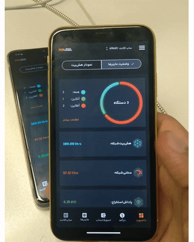

# Sample-iOS-android-app
Welcome to the Sample Application!

The Finance Application is a secure and adaptive mobile application developed using Flutter for both iOS and Android platforms to seamlessly adapt to both iOS and Android platforms. With its layered architecture using bloc, it provides an efficient user experience.

We prioritize the security of your financial data. The Finance Application implements industry-standard security measures to protect your sensitive information.
<p float="left">
  
     
  
</p>

## Architecture
The Finance Application follows a layered architecture and feature-driven development approach, allowing for easy expansion and scalability as our team adds new features.

At the core, we have the RemoteApi layer, which handles communication with the server using HTTP. Additionally, we have the LocalStorage layer, which utilizes Hive NoSQL database for efficient and fast data storage.

For each feature, we have a repository that acts as a bridge between the UI layer and the data layer. These repositories also include mappers to seamlessly map data models (API and local) to domain models, ensuring consistency across the UI and business logic layers.

On top of the repositories, we have the Component_library layer. This layer contains common widgets such as Scaffolds and TextFields as well as helper methods that adhere to Cupertino and Material Design specifications. We also have a theming model in this package to provide a consistent visual experience.

Besides the Component_library we have features packages like login, register, dashboard and etc. Look at this [application architecture](https://github.com/m8811163008/Quotes#architecture)

## Security
At the Finance Application, we prioritize the security of your financial data. To enhance the security measures, we have implemented the following features:

Biometric Access: For devices that support biometric capabilities, we have enabled biometric authentication to provide an extra layer of security This ensures that only authorized users can access the application during different lifecycle changes.

Secure Data Storage: To protect sensitive data such as sessions and credentials, we utilize secure shared preferences (AES-CBC-128 algorithm for encryption for both keys and values) and HiveCipher. These encryption techniques ensure that your data is stored securely and cannot be easily accessed by unauthorized individuals.

```dart
class KeyValueStorage {
  static const _secureKey = 'secure-sample-key';


  KeyValueStorage(
      {@visibleForTesting HiveInterface? hive,
      @visibleForTesting FlutterSecureStorage? secureStorage})
      : _hive = hive ?? Hive,
        _secureStorage = secureStorage ?? FlutterSecureStorage() {
    // register adaptors
  }


  Future<Box<T>> _openBox<T>(String boxKey,
      {required bool isTemporary, required bool isSecureBox}) async {
    List<int>? encryptionKeyUnit8List;
    if (isSecureBox) {
      final encryptedKey = await _secureStorage.read(key: _secureKey);
      if (encryptedKey == null) {
        final key = _hive.generateSecureKey();
        await _secureStorage.write(
            key: _secureKey, value: base64UrlEncode(key));
      }
      final key = await _secureStorage.read(key: _secureKey);
      encryptionKeyUnit8List = base64Url.decode(key!);
    }
    if (_hive.isBoxOpen(boxKey)) {
      return _hive.box(boxKey);
    }
    final directory = await (isTemporary
        ? getTemporaryDirectory()
        : getApplicationDocumentsDirectory());
    final encyptionCipher =
        isSecureBox ? HiveAesCipher(encryptionKeyUnit8List!) : null;
    return _hive.openBox(
      boxKey,
      path: directory.path,
      encryptionCipher: encyptionCipher,
    );
  }
}
```
## Cutome widgets
In application development, I strive to deliver a pixel-perfect user interface to honor our talented UI/UX design team and provide a high-fidelity product experience. I developed widgets to achieve this level of precision and attention to detail.

To create the pie chart, we utilized a custom painter and applied mathematical calculations to draw the arcs accurately. We also incorporated spacing between the segments and added curved designs at the end of each segment, ensuring a visually appealing chart.

Additionally, a challenge with the shadow effects algorithm when the drawer of scaffolds opens. To overcome this issue and ensure effective shadow effects, we implemented the ImageFiltered widget. This solution resolved the bug now the shadows are displayed seamlessly.

By leveraging custom widgets and implementing innovative solutions, we aim to provide an exceptional user experience within the Finance Application.
```dart
class CurvePainter extends CustomPainter {

  ...
  // Calculate the arc start offset relative to previous segments.
  Offset _calculateRelativeArcPoint(
      {required double angle, double lineLenght = 5, bool isStart = false}) {
    int kharejGhesmat = angle ~/ (2 * pi);
    angle = angle - kharejGhesmat * (2 * pi);

    late final double x;
    late final double y;
    if (angle >= 0 && angle <= pi / 2) {
      x = isStart ? -lineLenght * cos(angle) : -lineLenght * cos(angle);
      y = isStart ? -lineLenght * sin(angle) : -lineLenght * sin(angle);
    } else if (angle > pi / 2 && angle < pi) {
      x = lineLenght * sin(angle - pi / 2);
      y = -lineLenght * cos(angle - pi / 2);
    } else if (angle >= pi && angle <= 3 * pi / 2) {
      x = lineLenght * cos(angle - pi);
      y = lineLenght * sin(angle - pi);
    } else if (angle > 3 * pi / 2 && angle < 2 * pi) {
      x = -lineLenght * sin(angle - 3 * pi / 2);
      y = lineLenght * cos(angle - 3 * pi / 2);
    } else {
      throw Exception('degree is not valid');
    }
    return Offset(x, y);
  }

  // Returns the offset of the starting point of the first segment of the pie chart.
  Offset _calculateStartPoint(
      {required Offset center, required double radius, required double angle}) {
    final double x = radius * cos(angle);
    final double y = radius * sin(angle);
    return Offset(x, y) + center;
  }
}
```
## iOS development
I have utilized Cupertino widgets to ensure a seamless and native user on iOS devices. These widgets, such as the date picker, time picker, and bottom sheets, adhere to Apple's design guidelines ([iOS-human-interface](https://developer.apple.com/design/human-interface-guidelines)), providing a familiar and intuitive interface for iOS users.

We are committed to delivering a professional and polished iOS experience within cross-platform applications. For Android development, we adhere [Material Design Version 3](https://m3.material.io/) specifications.

